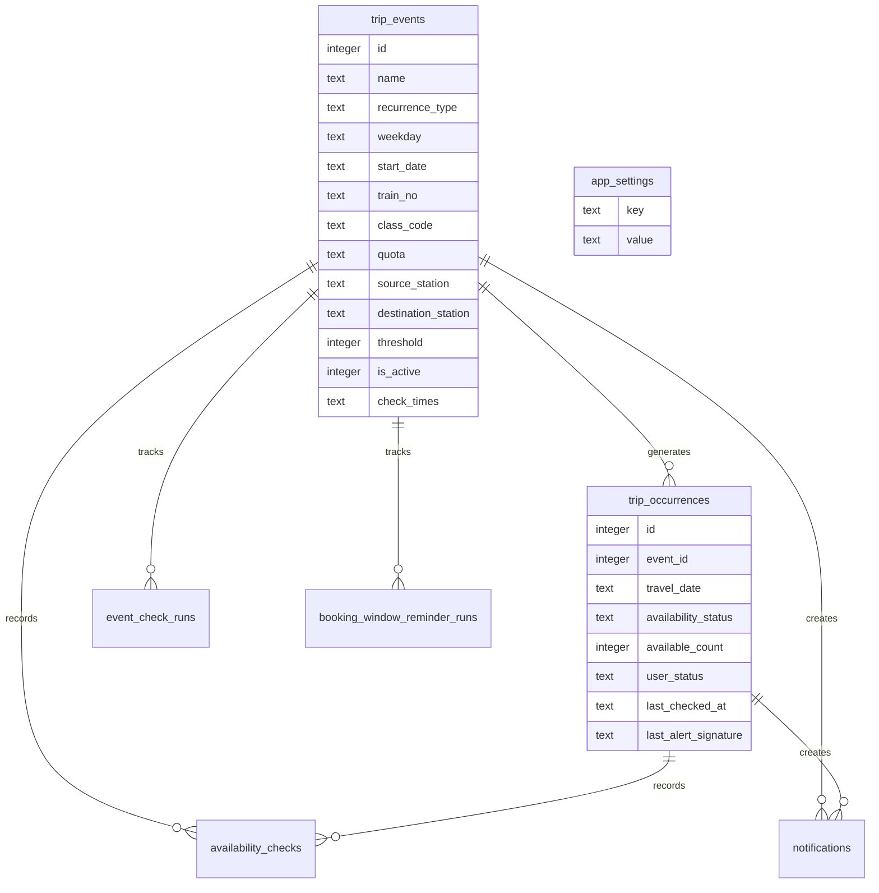
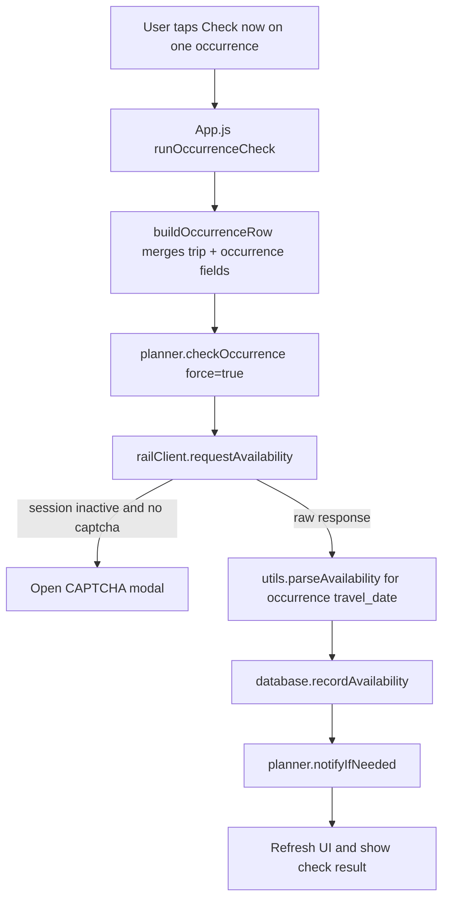
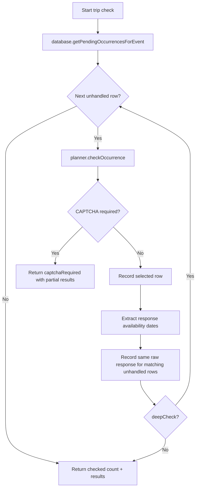
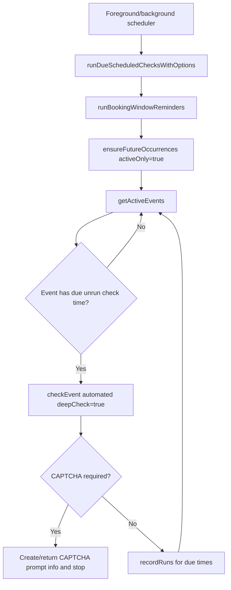
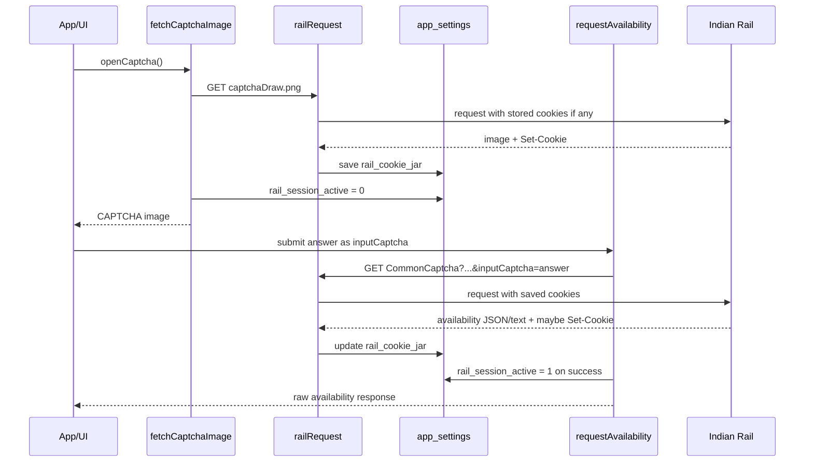
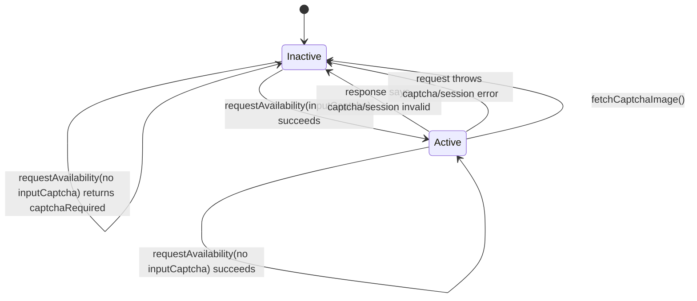
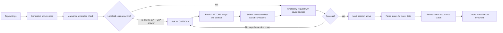

# Seat Availability, CAPTCHA, and Rail Session Flow

This document explains how the app checks train seat availability for a single travel date, for all generated trip occurrences, and during scheduled background or foreground checks. It also explains how the CAPTCHA and Indian Rail session state are reused across API calls.

## Main Files

| Area | File | Responsibility |
| --- | --- | --- |
| UI actions | `App.js` | Starts manual checks, opens CAPTCHA modal, submits CAPTCHA, refreshes local state. |
| CAPTCHA modal state | `src/hooks/useCaptchaFlow.js` | Loads CAPTCHA image, stores pending check context, handles cancel/reset. |
| Scheduled catch-up | `src/hooks/useForegroundCatchUp.js` | Runs due checks when the app opens or returns to foreground. |
| Background task | `src/background.js` | Registers and runs periodic availability checks. |
| Planner/check logic | `src/planner.js` | Decides which occurrences to check, parses responses, records results, sends alerts. |
| Indian Rail API client | `src/railClient.js` | Manages cookies, CAPTCHA image, session active flag, and availability requests. |
| Local storage | `src/database.js` | Stores trips, occurrences, availability history, notifications, run history, app settings. |
| Parsing/helpers | `src/utils.js` | Generates occurrence dates and parses availability statuses/counts. |

## Data Model



Important `app_settings` keys:

| Key | Meaning |
| --- | --- |
| `rail_cookie_jar` | Stored Indian Rail cookies reused by all rail requests. |
| `rail_session_active` | Local flag: `1` means the last availability request succeeded without CAPTCHA/session error. |
| `rail_session_last_used` | Timestamp written whenever the local session flag changes. |
| `rail_reference_trains` | Cached train autocomplete data. |
| `rail_reference_stations` | Cached station autocomplete data. |
| `captcha_notification_date_<eventId>` | Prevents repeated CAPTCHA notifications for the same trip on the same day. |
| `auto_captcha_cooldown_until_<eventId>` | Prevents repeated automatic CAPTCHA popups after the user cancels an automated prompt. |

## Occurrence Generation

Occurrences are local travel dates generated from each trip's recurrence settings.

`generateTravelDates()` in `src/utils.js` supports:

| Recurrence | Logic |
| --- | --- |
| `daily` | Every date from `start_date` or today through the generation window. |
| `weekly` | Every matching weekday from today through the generation window. |
| `fortnightly` | Every 15 days from `start_date`, advanced until today if needed. |
| `monthly` | Every month from `start_date`, advanced until today if needed. |

`insertOccurrences()` stores those dates in `trip_occurrences` with `user_status = 'pending'`.

`ensureFutureOccurrences(activeOnly)` regenerates missing future occurrences:

- `activeOnly = false`: used during app refresh/startup and booking reminder flow.
- `activeOnly = true`: used before scheduled availability checks so inactive trips are not automatically checked.

## Single-Day Check

A single-day check means the user taps `Check now` on one occurrence in the Calendar screen.

Code path:

1. `CalendarScreen` calls `runOccurrenceCheck(selectedEvent, occurrence)`.
2. `runOccurrenceCheck()` builds a full row with trip details using `buildOccurrenceRow()`.
3. It calls `checkOccurrence(row, { force: true })`.
4. `checkOccurrence()` calls `requestAvailability(row, options)`.
5. `requestAvailability()` either returns `captchaRequired` or a raw Indian Rail response.
6. `parseAvailability(raw, row.travel_date)` extracts the status for that exact travel date.
7. `recordAvailability()` writes:
   - one row in `availability_checks`
   - latest status/count/check time back to `trip_occurrences`
8. `notifyIfNeeded()` may create an alert if the result is at or below the trip threshold.



Because `force: true` is used, a single-day manual check can run even if the occurrence is marked `booked` or `ignored`. Without `force`, `checkOccurrence()` skips non-pending occurrences.

## Trip or Occurrence Batch Check

A trip check means the app checks generated occurrences for one trip.

Code path:

1. `runEventCheck(event)` or `submitCaptcha()` calls `checkEvent(event.id, options)`.
2. `checkEvent()` loads rows using `getPendingOccurrencesForEvent()`.
3. It loops through date-ordered occurrences.
4. The first checked row may receive `inputCaptcha`.
5. Later rows do not receive `inputCaptcha`; they rely on the session/cookie state established by the first successful request.
6. If the Indian Rail response contains availability for multiple dates, `checkEvent()` reuses that raw response for matching future rows by calling `recordOccurrenceFromRaw()`.
7. If `deepCheck` is false, `checkEvent()` stops after the first successful request/response group.
8. If `deepCheck` is true, it continues until all eligible rows are handled or CAPTCHA is required.



### Why One API Response Can Update Multiple Occurrences

Indian Rail availability responses may include an `avlDayList` or another nested list of availability days. `availabilityDatesFromRaw()` reads those dates from the raw response. For each later local occurrence whose `travel_date` appears in the response, `recordOccurrenceFromRaw()` parses and records that same raw response for that occurrence.

This avoids extra API calls when one response already contains multiple travel dates.

### How Many Availability API Calls Are Made?

The answer depends on how many occurrence dates are already covered by each Indian Rail availability response.

The app calls the Indian Rail availability endpoint here:

```js
GET /enquiry/CommonCaptcha?...date...
```

`checkEvent()` starts with the first unhandled occurrence. After each successful API response, it checks whether that response contains availability for other occurrence dates. Any matching dates are recorded locally without another availability API call.

So the rule is:

```text
availability API calls for one trip =
  number of times checkEvent() must call checkOccurrence()
  until all eligible occurrences are handled
```

It is not always:

```text
number of occurrences = number of API calls
```

#### Example: 1 Trip With 10 Occurrences

Suppose one trip has 10 generated occurrences.

| Indian Rail response behavior | Availability API calls |
| --- | ---: |
| First response contains all 10 occurrence dates | 1 call |
| Each response contains only the requested date | 10 calls |
| First response contains 6 dates, second contains remaining 4 | 2 calls |
| First response contains 3 dates, second contains 3, third contains 4 | 3 calls |

In the best case, one trip with 10 occurrences makes 1 availability API call.

In the worst case, one trip with 10 occurrences makes 10 availability API calls.

#### Example: Weekly Trip With 10 Occurrences

Suppose a trip has 10 weekly occurrences:

```text
Week 1, Week 2, Week 3, ... Week 10
```

The dates are 7 days apart. If Indian Rail `avlDayList` usually returns 13 to 15 calendar dates from the requested journey date, then one API response usually covers only the weekly occurrence dates that fall inside that 13-15 day window.

| `avlDayList` window | Weekly occurrences covered by one response | Calls for 10 weekly occurrences |
| --- | ---: | ---: |
| 13 dates | 2 occurrences | 5 calls |
| 14 dates | 2 occurrences | 5 calls |
| 15 dates | 3 occurrences | 4 calls |

So for 10 weekly occurrences, the usual availability API call count is around 4 to 5 calls for one trip.

Example with a 15-date response:

```text
Call 1 checks Week 1 and response also covers Week 2, Week 3
Call 2 checks Week 4 and response also covers Week 5, Week 6
Call 3 checks Week 7 and response also covers Week 8, Week 9
Call 4 checks Week 10
```

This assumes the `avlDayList` starts from the requested journey date and contains continuous calendar dates. If Indian Rail returns fewer matching dates for that train/route/class/quota, the call count can be higher.

#### Example: 2 Trips With 10 Occurrences Each

`runEventCheckBatch()` checks trips one by one. API response reuse does not cross trip boundaries because each trip can have a different train, route, class, quota, and date set.

| Scenario | Trip 1 calls | Trip 2 calls | Total availability API calls |
| --- | ---: | ---: | ---: |
| Each trip's first response covers all 10 dates | 1 | 1 | 2 |
| Each response covers only one date | 10 | 10 | 20 |
| Trip 1 needs 2 calls, Trip 2 needs 5 calls | 2 | 5 | 7 |

So for 2 trips with 10 occurrences each:

- best case: 2 availability API calls
- worst case: 20 availability API calls
- actual case: depends on how many dates Indian Rail returns per response

#### CAPTCHA and Reference API Calls Are Separate

The counts above are only availability API calls.

There can be extra rail API calls:

| Extra call | When it happens |
| --- | --- |
| CAPTCHA image API call | When the local session is inactive and the user must solve CAPTCHA. |
| Train reference API call | First time train autocomplete/reference data is needed, then cached for 24 hours. |
| Station reference API call | First time station autocomplete/reference data is needed, then cached for 24 hours. |

If the local session is inactive, the first check does not immediately call the availability endpoint. `requestAvailability()` returns `{ captchaRequired: true }` locally. Then the app fetches a CAPTCHA image. After the user submits the CAPTCHA, the next availability request sends `inputCaptcha`.

Example for 2 trips with 10 occurrences each, first run of the day, no cached references, session inactive, and each trip's first availability response covers all 10 dates:

| Type | Calls |
| --- | ---: |
| CAPTCHA image | 1 |
| Train reference | 1 |
| Station reference | 1 |
| Availability for trip 1 | 1 |
| Availability for trip 2 | 1 |
| Total rail HTTP calls | 5 |

If train/station references are already cached and the session is active, the same case is only 2 rail HTTP calls total, both availability calls.

## All Active Trips Check

The `Check all` action only includes active trips:

```js
const activeEvents = events.filter((event) => event.is_active);
```

Then `runEventCheckBatch()` checks each trip using:

```js
checkEvent(event.id, {
  suppressNotifications: false,
  deepCheck: true,
  includeAllStatuses
})
```

If CAPTCHA is required in the middle of the batch, the app pauses and stores resume information in `pendingCheck`:

- remaining event IDs
- checked occurrence count so far
- checked event count so far
- whether all occurrence statuses were included

After the user submits CAPTCHA successfully, `submitCaptcha()` resumes the remaining event list.

## Scheduled Checks

Scheduled checks run from two places:

| Runner | File | Trigger |
| --- | --- | --- |
| Foreground catch-up | `src/hooks/useForegroundCatchUp.js` | Startup and app returning to active state. |
| Background fetch | `src/background.js` | Expo background fetch, minimum interval 15 minutes. |

Both call `runDueScheduledChecksWithOptions()` or `runDueScheduledChecks()`.

Scheduled flow:

1. Run booking-window reminders.
2. Ensure future occurrences for active trips only.
3. Load active events from `getActiveEvents()`.
4. For each active event:
   - parse `check_times`
   - calculate due times using local `HH:mm`
   - skip scheduled times already recorded in `event_check_runs`
5. If any unrun due time exists, call `checkEvent(event.id, { automated: true, deepCheck: true })`.
6. If check succeeds, record all due scheduled times with `recordRuns()`.
7. If CAPTCHA is required, stop and return the trip needing CAPTCHA.



## CAPTCHA Reuse Across APIs

CAPTCHA reuse is session-based, not answer-based.

The app does not store the CAPTCHA text for future requests. Instead:

1. `fetchCaptchaImage()` calls `/captchaDraw.png?...`.
2. `railRequest()` stores any `Set-Cookie` headers into `rail_cookie_jar`.
3. The user submits the CAPTCHA answer.
4. The next `requestAvailability()` sends:
   - stored cookies from `rail_cookie_jar`
   - `inputCaptcha=<user answer>`
5. If the availability request succeeds, `markSessionActive(true)` writes `rail_session_active = 1`.
6. Later API calls reuse the same cookies and skip `inputCaptcha` as long as the local session is active.



### Reuse Across Reference APIs

All rail calls go through `railRequest()`, including:

- CAPTCHA image requests
- train autocomplete/reference requests
- station autocomplete/reference requests
- availability requests

That means they all share the same persisted cookie jar. Train and station reference data are additionally cached for 24 hours in `rail_reference_trains` and `rail_reference_stations`.

### Reuse Within `checkEvent()`

When checking multiple occurrences for one trip:

```js
inputCaptcha: index === 0 ? options.inputCaptcha : ''
```

Only the first availability request receives the CAPTCHA answer. After that first request succeeds, `requestAvailability()` marks the session active. Later occurrence checks rely on:

- `rail_session_active = 1`
- cookies in `rail_cookie_jar`
- no `inputCaptcha`

If any later request reports a CAPTCHA/session problem, the trip check stops and asks for CAPTCHA again.

## Session Active/Inactive Logic

The app's session state is a local flag stored in `app_settings`. It is not calculated from an expiry timestamp.

### Session Becomes Inactive

`rail_session_active` is set to `0` when:

| Case | Function | Reason |
| --- | --- | --- |
| CAPTCHA image is loaded | `fetchCaptchaImage()` | A new CAPTCHA challenge is being prepared, so previous validation is no longer trusted. |
| Availability response says CAPTCHA/session expired/invalid | `requestAvailability()` | Indian Rail indicated the request cannot continue. |
| Availability request throws a CAPTCHA/session-like HTTP error | `requestAvailability()` | HTTP status or response body indicates invalid/expired session. |
| Any non-CAPTCHA availability error is thrown | `requestAvailability()` catch block | The catch path marks inactive before rethrowing. |

### Session Becomes Active

`rail_session_active` is set to `1` only when:

- `requestAvailability()` receives a response that does not look like a CAPTCHA/session error.

### Session Is Considered Usable

At the start of `requestAvailability()`:

```js
const session = await getSessionStatus();
if (!options.inputCaptcha && !session.isActive) {
  return { captchaRequired: true };
}
```

So an availability request can proceed only if either:

- the caller provides `inputCaptcha`, or
- `rail_session_active` is already `1`.



## CAPTCHA Prompting Rules

| Flow | What happens when CAPTCHA is required |
| --- | --- |
| Single occurrence manual check | Opens CAPTCHA with `{ type: 'occurrence', eventId, occurrenceId }`. |
| Single trip manual check | Opens CAPTCHA with `{ type: 'event', eventId }`. |
| All active trips batch | Opens CAPTCHA with current event plus resume metadata for remaining trips. |
| Background scheduled check | Creates one CAPTCHA notification per event per day. |
| Foreground scheduled catch-up | Opens CAPTCHA modal unless that event is in auto CAPTCHA cooldown. |

If an automated foreground CAPTCHA modal is cancelled, `cancelCaptcha()` starts a cooldown for that event. This avoids repeatedly popping the CAPTCHA every time the app returns to foreground. Manual CAPTCHA opens clear the cooldown.

## Availability Parsing and Alerts

`parseAvailability(raw, travelDate)` handles two response shapes:

1. A structured availability-day list, commonly `avlDayList`.
2. A fallback scan through nested response values for statuses like `AVAILABLE`, `RAC`, `WL`, `REGRET`, `NOT AVAILABLE`, `NOT RUNNING`, or `TRAIN CANCELLED`.

For structured responses, only the status matching the requested `travelDate` is used.

Alert logic:

- `parseAvailableCount()` extracts counts from statuses like `AVAILABLE-005`.
- `isBelowThresholdStatus()` returns true when:
  - available count is less than or equal to the trip threshold, or
  - status is RAC/WL and not a hard not-available status.
- `notifyIfNeeded()` only sends availability alerts for `user_status = 'pending'`.
- Duplicate alerts are prevented with `last_alert_signature`.

## End-to-End Summary



In short: a single-day check checks exactly one local occurrence, while a trip check loops over pending occurrences and can update multiple occurrence dates from one Indian Rail response. CAPTCHA is reused by reusing the validated rail session and cookie jar, not by storing the CAPTCHA answer. The session is active only after a successful availability response and inactive whenever a CAPTCHA is fetched or Indian Rail reports a session/CAPTCHA problem.
